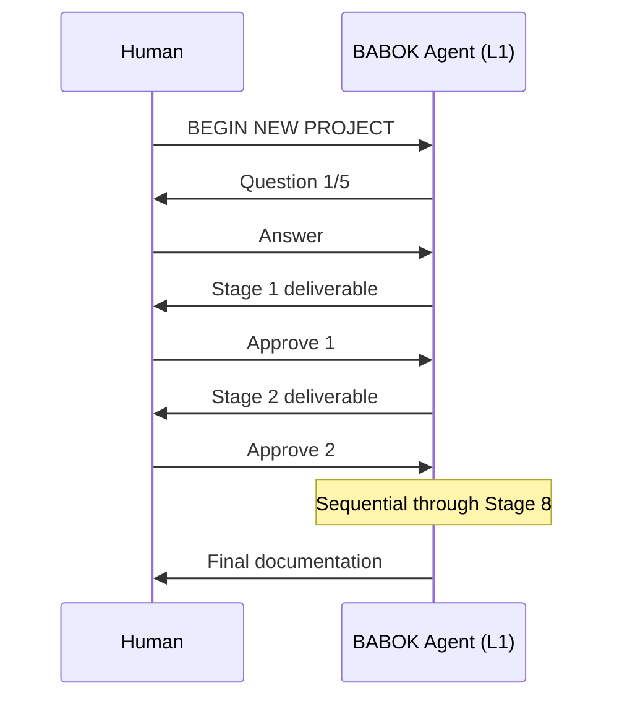
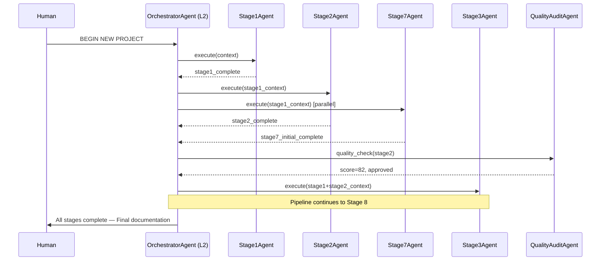
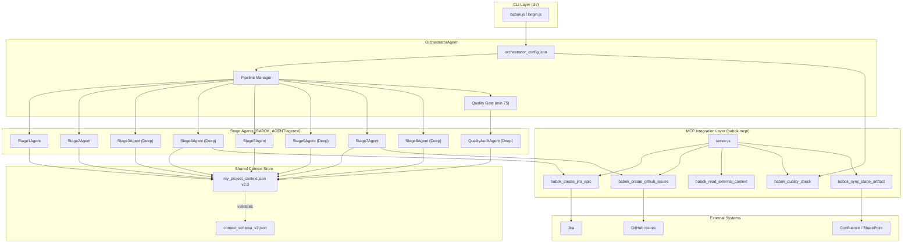
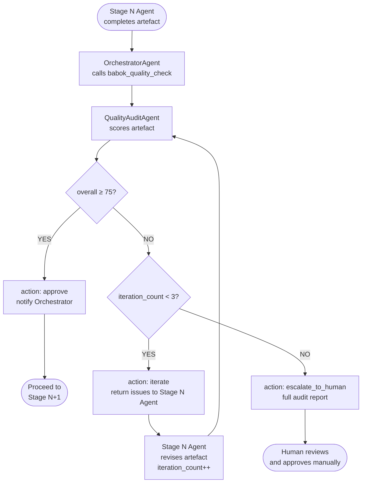
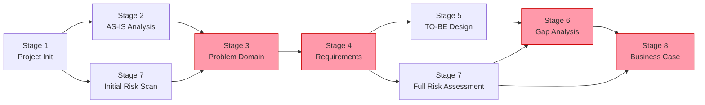

> **Version:** 2.0 | **Status:** Draft | **Date:** 2026-03-30

# L2 & L3 Architecture: Multi-Agent Orchestration and Autonomous Quality Loop

## Table of Contents

1. [Maturity Map L1→L5](#1-maturity-map-l1l5)
2. [L2 Architecture — Multi-Agent Orchestration](#2-l2-architecture--multi-agent-orchestration)
3. [L3 Architecture — Autonomous Quality Loop](#3-l3-architecture--autonomous-quality-loop)
4. [New agent_config.json Schema for L2](#4-new-agent_configjson-schema-for-l2)
5. [Extended Context Store v2.0 Schema](#5-extended-context-store-v20-schema)
6. [MCP Tools Specification Summary](#6-mcp-tools-specification-summary)
7. [Implementation Roadmap L2→L3](#7-implementation-roadmap-l2l3)
8. [Architecture Diagrams (Mermaid)](#8-architecture-diagrams-mermaid)

---

## 1. Maturity Map L1→L5

| Level | Name | Description | Status | Key Differentiators |
|-------|------|-------------|--------|---------------------|
| **L1** | Guided Agent | Single agent drives the analyst through 8 BABOK stages sequentially. Human approves each stage before proceeding. Model selection (Standard / Deep) handled in-prompt. | ✅ **Achieved** (`v1.8`) | Interactive, sequential, human-in-the-loop at every step |
| **L2** | Multi-Agent Orchestration | Each BABOK stage becomes a dedicated, specialised agent. An `OrchestratorAgent` manages routing, context sharing, and parallel execution. MCP integration layer connects to enterprise tools (Jira, GitHub, Confluence). | 🔧 **Next target** — foundations in `babok-mcp/` | Agent decomposition, parallel execution, MCP tool calls, shared context store |
| **L3** | Autonomous Quality Loop | A `QualityAuditAgent` runs after every stage, scores artefacts (Completeness / Consistency / SMART), and iterates autonomously up to 3 times before escalating to a human. | 🗺️ **Follows L2** | Self-correction loop, quality gates, escalation protocol |
| **L4** | Event-Driven Enterprise | Pipeline triggered by external events (GitHub push, Jira epic creation, Confluence page update). Agent runs 24/7 as a silent organisational analyst. | 🚀 **Vision** | Webhook listeners, CI/CD integration, proactive analysis |
| **L5** | Self-Improving Orchestrator | Agent evaluates its own past performance, adapts prompts and scoring rubrics, and proposes improvements to the BABOK framework configuration. | 🌐 **Horizon** | Meta-learning, automated prompt engineering, BABOK v3+ alignment |

> **Current implementation target:** L2 (Sections 2, 4, 5, 6, 7) and L3 (Section 3).

---

## 2. L2 Architecture — Multi-Agent Orchestration

### 2.1 Agent Hierarchy

```
OrchestratorAgent  (gemini-2.0-flash, temp 0.3)
├── Stage1Agent    — Project Initialization & Stakeholder Mapping   [Standard Mode]
├── Stage2Agent    — Current State Analysis (AS-IS)                  [Standard Mode] ─┐ parallel
├── Stage3Agent    — Problem Domain Analysis                          [Deep Mode]      │
├── Stage4Agent    — Solution Requirements Definition                 [Deep Mode]      │
├── Stage5Agent    — Future State Design (TO-BE)                      [Standard Mode]  │
├── Stage6Agent    — Gap Analysis & Roadmap                           [Deep Mode]      │
├── Stage7Agent    — Risk Assessment                                  [Standard Mode] ─┘ parallel with Stage2
└── Stage8Agent    — Business Case & ROI                              [Deep Mode]
```

### 2.2 Agent Communication Protocol

Each agent communicates through a **shared context store** (`my_project_context.json` v2.0). The protocol follows three primitives:

| Primitive | Direction | Payload | Description |
|-----------|-----------|---------|-------------|
| `WRITE_ARTIFACT` | Agent → Store | `{ stage, artifact_path, summary }` | Agent saves its deliverable to the store |
| `READ_ARTIFACT` | Agent → Store | `{ stage }` | Agent reads a prior stage's deliverable |
| `POST_MESSAGE` | Agent → Store | `{ from, to, type, content }` | Broadcast or directed message between agents |

**Message types:** `stage_complete`, `quality_approved`, `quality_iterate`, `quality_escalate`, `context_update`, `pipeline_error`.

### 2.3 Parallel Execution Groups

The pipeline supports one parallel execution group at the start of the pipeline to reduce total elapsed time:

```
Sequential:  Stage1 → [ Stage2 ∥ Stage7_initial_risk_scan ] → Stage3 → Stage4 → Stage5 → Stage6 → Stage8
```

**Rationale:** Stage 2 (Current State Analysis) and the initial pass of Stage 7 (Risk Assessment) share no output dependency — both read only from Stage 1 artefacts. All other stages have explicit predecessor dependencies.

**Stage dependency graph:**

```
Stage1 → Stage2 → Stage3 → Stage4 → Stage5 → Stage6 → Stage8
Stage1 → Stage7 (initial scan, parallel with Stage2)
Stage7 (full) requires Stage4 output
```

### 2.4 MCP Integration Layer

Built on top of the existing `babok-mcp/src/server.js`. The orchestrator exposes MCP tools to all stage agents.

**Tool routing table:**

| MCP Tool | Called By | Stage | Description |
|----------|-----------|-------|-------------|
| `babok_get_stage_artifact` | All stage agents | Any | Read prior stage deliverable from context store |
| `babok_quality_check` | OrchestratorAgent | After each stage | Invoke QualityAuditAgent for a given stage |
| `babok_create_jira_epic` | Stage4Agent | Stage 4 | Create Jira epics from requirements |
| `babok_create_github_issues` | Stage7Agent | Stage 7 | Bulk-create GitHub Issues from Risk Register |
| `babok_read_external_context` | Stage1Agent, Stage2Agent | Stage 1–2 | Ingest external documents (URL or file) |
| `babok_sync_stage_artifact` | OrchestratorAgent | On approve | Export artefact to Confluence/SharePoint |

Full tool specifications: see [`MCP_TOOLS_SPECIFICATION.md`](./MCP_TOOLS_SPECIFICATION.md).

### 2.5 Context Store v2.0 (shared state)

The existing `my_project_context.json` is extended to `schema_version: "2.0"` to support multi-agent state. Full schema: see [Section 5](#5-extended-context-store-v20-schema) and [`BABOK_AGENT/agents/context_schema_v2.json`](../BABOK_AGENT/agents/context_schema_v2.json).

---

## 3. L3 Architecture — Autonomous Quality Loop

### 3.1 QualityAuditAgent Role

The `QualityAuditAgent` is an independent reviewer that runs after every stage completes. It is invoked by the `OrchestratorAgent` via the `babok_quality_check` MCP tool.

**Model:** `gemini-pro` (Deep Analysis Mode)  
**System Prompt:** [`BABOK_AGENT/agents/quality_audit_agent.md`](../BABOK_AGENT/agents/quality_audit_agent.md)  
**Scoring Rubric:** [`BABOK_AGENT/agents/quality_scoring_rubric.json`](../BABOK_AGENT/agents/quality_scoring_rubric.json)

### 3.2 Quality Scoring System

| Dimension | Weight | Description |
|-----------|--------|-------------|
| **Completeness** | 40% | Percentage of BABOK v3 required sections present |
| **Consistency** | 30% | Percentage of elements traceable to prior stage outputs |
| **SMART / Quality** | 30% | Percentage of goals/requirements meeting SMART criteria |

**Overall Score formula:**
```
overall = (completeness × 0.40) + (consistency × 0.30) + (smart × 0.30)
```

**Quality Gate:** Minimum overall score of **75 / 100** required to proceed to the next stage.

### 3.3 Autonomous Iteration Protocol

```
Stage N completes
       │
       ▼
QualityAuditAgent scores artefact
       │
   overall ≥ 75?
  ┌────┴────┐
  YES       NO
  │         │
  ▼         ▼
approve   iteration_count < 3?
notify    ┌────┴────┐
Orch.    YES       NO
          │         │
          ▼         ▼
     return issues  escalate_to_human
     to StageNAgent (full report)
          │
          ▼
     StageNAgent revises
     (iteration_count++)
          │
          └─────────► loop
```

**Max iterations:** 3  
**Escalation:** After 3 failed iterations, the `QualityAuditAgent` sends an `escalate_to_human` message with a complete audit report including all issues, scores, and recommendations.

### 3.4 Audit Output Format

```json
{
  "stage": "stage_N",
  "timestamp": "2026-03-30T07:48:39Z",
  "iteration": 1,
  "scores": {
    "completeness": 85,
    "consistency": 78,
    "quality": 72,
    "overall": 79
  },
  "passed": true,
  "issues": [
    {
      "severity": "minor",
      "section": "Success Criteria",
      "description": "Two KPIs lack a baseline measurement",
      "recommendation": "Add baseline values with source references"
    }
  ],
  "action": "approve"
}
```

---

## 4. New agent_config.json Schema for L2

The existing `agent_config.json` is extended to add `orchestrator`, `agents`, `mcp`, and `context_store` sections. The original `agent`, `capabilities`, `techniques`, `deliverables`, and `llm` sections are preserved for backward compatibility.

```json
{
  "agent": { "...existing fields..." },
  "capabilities": ["..."],
  "orchestrator": {
    "name": "BABOK Orchestrator",
    "version": "2.0",
    "model": {
      "provider": "gemini",
      "model": "gemini-2.0-flash",
      "temperature": 0.3
    },
    "pipeline": {
      "mode": "sequential_with_parallel_options",
      "parallel_groups": [
        ["stage2", "stage7_initial_risk_scan"]
      ],
      "mandatory_sequence": ["stage1", "stage3", "stage4", "stage5", "stage6", "stage8"]
    },
    "quality_gate": {
      "enabled": true,
      "agent": "quality_audit",
      "min_score": 75,
      "max_iterations": 3,
      "escalate_to_human_after": 3
    }
  },
  "agents": {
    "stage1": { "model": "gemini-2.0-flash", "temperature": 0.7, "mode": "standard" },
    "stage2": { "model": "gemini-2.0-flash", "temperature": 0.7, "mode": "standard" },
    "stage3": { "model": "gemini-pro", "temperature": 0.5, "mode": "deep_analysis" },
    "stage4": { "model": "gemini-pro", "temperature": 0.5, "mode": "deep_analysis" },
    "stage5": { "model": "gemini-2.0-flash", "temperature": 0.7, "mode": "standard" },
    "stage6": { "model": "gemini-pro", "temperature": 0.5, "mode": "deep_analysis" },
    "stage7": { "model": "gemini-2.0-flash", "temperature": 0.7, "mode": "standard" },
    "stage8": { "model": "gemini-pro", "temperature": 0.5, "mode": "deep_analysis" },
    "quality_audit": {
      "model": "gemini-pro",
      "temperature": 0.3,
      "mode": "deep_analysis",
      "max_iterations": 3,
      "min_score": 75
    }
  },
  "mcp": {
    "server": "./babok-mcp/src/server.js",
    "tools": [
      "file_system",
      "babok_create_jira_epic",
      "babok_create_github_issues",
      "babok_read_external_context",
      "babok_quality_check",
      "babok_sync_stage_artifact",
      "babok_get_stage_artifact"
    ],
    "enabled": true
  },
  "context_store": {
    "type": "json_file",
    "path": "./my_project_context.json",
    "schema_version": "2.0",
    "schema_file": "./BABOK_AGENT/agents/context_schema_v2.json"
  }
}
```

The full updated file lives at [`agent_config.json`](../agent_config.json).

---

## 5. Extended Context Store v2.0 Schema

The v2.0 context store extends the existing `my_project_context.json` with multi-agent tracking fields. Existing v1.x projects can be migrated following the steps in [`MIGRATION_GUIDE_L1_to_L2.md`](./MIGRATION_GUIDE_L1_to_L2.md).

```json
{
  "schema_version": "2.0",
  "project": {
    "id": "BABOK-20260330-XXXX",
    "name": "Project Name",
    "language": "EN",
    "created_at": "2026-03-30T07:48:39Z",
    "last_updated": "2026-03-30T07:48:39Z"
  },
  "stages": {
    "stage1": {
      "status": "approved",
      "artifacts": [
        { "type": "markdown", "path": "BABOK_Analysis/PROJECT_ID/STAGE_01_Project_Initialization.md" }
      ],
      "approved_at": "2026-03-30T09:00:00Z",
      "approved_by": "human"
    },
    "stage2": { "status": "in_progress", "artifacts": [], "approved_at": null, "approved_by": null }
  },
  "quality_reports": {
    "stage1": {
      "completeness": 95,
      "consistency": 88,
      "smart": 90,
      "overall": 91,
      "passed": true,
      "issues": [],
      "iteration": 1
    }
  },
  "agent_messages": [
    {
      "id": "msg-001",
      "from": "stage1",
      "to": "orchestrator",
      "type": "stage_complete",
      "timestamp": "2026-03-30T08:55:00Z",
      "content": "Stage 1 artefact written to context store"
    }
  ],
  "decisions": [],
  "assumptions": [],
  "risks": []
}
```

Formal JSON Schema (draft-07): [`BABOK_AGENT/agents/context_schema_v2.json`](../BABOK_AGENT/agents/context_schema_v2.json).

---

## 6. MCP Tools Specification Summary

Five new MCP tools are added to `babok-mcp/src/server.js`. Full specifications (input/output schemas, example calls, implementation notes) are in [`MCP_TOOLS_SPECIFICATION.md`](./MCP_TOOLS_SPECIFICATION.md).

| # | Tool Name | Invoked By | Purpose |
|---|-----------|------------|---------|
| 1 | `babok_create_jira_epic` | Stage4Agent | Create Jira epics from Stage 4 requirements |
| 2 | `babok_create_github_issues` | Stage7Agent | Bulk-create GitHub Issues from Stage 7 Risk Register |
| 3 | `babok_read_external_context` | Stage1Agent, Stage2Agent | Ingest external document (URL or local file) |
| 4 | `babok_quality_check` | OrchestratorAgent | Invoke QualityAuditAgent for a given stage |
| 5 | `babok_sync_stage_artifact` | OrchestratorAgent | Export stage artefact to Confluence/SharePoint |

Additionally, `babok_get_stage_artifact` (existing capability extended) reads any stage artefact from the context store.

---

## 7. Implementation Roadmap L2→L3

### Phase 1 (Week 1–2): Context Store v2.0

**Goal:** Upgrade shared context to support multi-agent state.

| Task | File(s) | Verification |
|------|---------|--------------|
| Add `schema_version`, `stages`, `quality_reports`, `agent_messages` fields | `my_project_context.json` | File validates against `context_schema_v2.json` |
| Create formal JSON Schema | `BABOK_AGENT/agents/context_schema_v2.json` | Valid JSON Schema draft-07 |
| Update `agent_config.json` to reference schema | `agent_config.json` | `context_store.schema_file` field present |

**Done criteria:** `ajv validate --schema context_schema_v2.json my_project_context.json` passes.

---

### Phase 2 (Week 3–4): MCP Tool Expansion

**Goal:** Add 5 new MCP tools to the existing server.

| Task | File(s) | Verification |
|------|---------|--------------|
| Implement `babok_create_jira_epic` | `babok-mcp/src/server.js` | Tool listed in `server.tools` |
| Implement `babok_create_github_issues` | `babok-mcp/src/server.js` | Tool listed in `server.tools` |
| Implement `babok_read_external_context` | `babok-mcp/src/server.js` | Tool listed in `server.tools` |
| Implement `babok_quality_check` | `babok-mcp/src/server.js` | Tool listed in `server.tools` |
| Implement `babok_sync_stage_artifact` | `babok-mcp/src/server.js` | Tool listed in `server.tools` |
| Add tests for all 5 tools | `babok-mcp/src/test/` | `npm test` passes |

**Done criteria:** All 5 tools return correct responses in integration tests; `npm test` exits 0.

---

### Phase 3 (Week 5–6): Agent Decomposition

**Goal:** Split the monolithic BABOK agent into 8 stage agents + orchestrator.

| Task | File(s) | Verification |
|------|---------|--------------|
| Create orchestrator config | `BABOK_AGENT/agents/orchestrator_config.json` | Valid JSON |
| Create per-stage agent configs | `BABOK_AGENT/agents/stage{1..8}_config.json` | Each valid JSON |
| Update `agent_config.json` | `agent_config.json` | `agents` and `orchestrator` sections present |
| Wire orchestrator to MCP | `agent_config.json` → `mcp.server` | MCP server path resolves |

**Done criteria:** OrchestratorAgent can read `orchestrator_config.json` and route to Stage1Agent without error.

---

### Phase 4 (Week 7–8): QualityAuditAgent

**Goal:** Implement the autonomous quality loop.

| Task | File(s) | Verification |
|------|---------|--------------|
| Write QualityAuditAgent system prompt | `BABOK_AGENT/agents/quality_audit_agent.md` | Document complete per spec |
| Create scoring rubric JSON | `BABOK_AGENT/agents/quality_scoring_rubric.json` | Valid JSON; all 8 stages covered |
| Register agent in config | `agent_config.json` → `agents.quality_audit` | Config references `quality_audit_agent.md` |
| Enable quality gate in orchestrator | `BABOK_AGENT/agents/orchestrator_config.json` | `quality_gate.enabled: true` |
| End-to-end test: iterate→approve | Manual or automated | Agent passes after ≤3 iterations on sample artefact |

**Done criteria:** QualityAuditAgent autonomously scores a Stage 1 sample artefact, identifies a missing RACI matrix, requests correction, and approves the revised artefact.

---

## 8. Architecture Diagrams (Mermaid)

### 8.1 L1 (Single Agent, Sequential) vs L2 (Multi-Agent, Parallel)





---

### 8.2 L2 Component Architecture



---

### 8.3 L3 Quality Loop Flowchart



---

### 8.4 Stage Dependency Graph



> Red nodes = Deep Analysis Mode (gemini-pro).

---

*Cross-references:*
- [`MCP_TOOLS_SPECIFICATION.md`](./MCP_TOOLS_SPECIFICATION.md) — full tool specifications
- [`MIGRATION_GUIDE_L1_to_L2.md`](./MIGRATION_GUIDE_L1_to_L2.md) — migration guide for existing L1 users
- [`BABOK_AGENT/agents/orchestrator_config.json`](../BABOK_AGENT/agents/orchestrator_config.json) — orchestrator configuration
- [`BABOK_AGENT/agents/quality_audit_agent.md`](../BABOK_AGENT/agents/quality_audit_agent.md) — QualityAuditAgent system prompt
- [`BABOK_AGENT/agents/quality_scoring_rubric.json`](../BABOK_AGENT/agents/quality_scoring_rubric.json) — scoring rubric
- [`BABOK_AGENT/agents/context_schema_v2.json`](../BABOK_AGENT/agents/context_schema_v2.json) — context store JSON Schema
